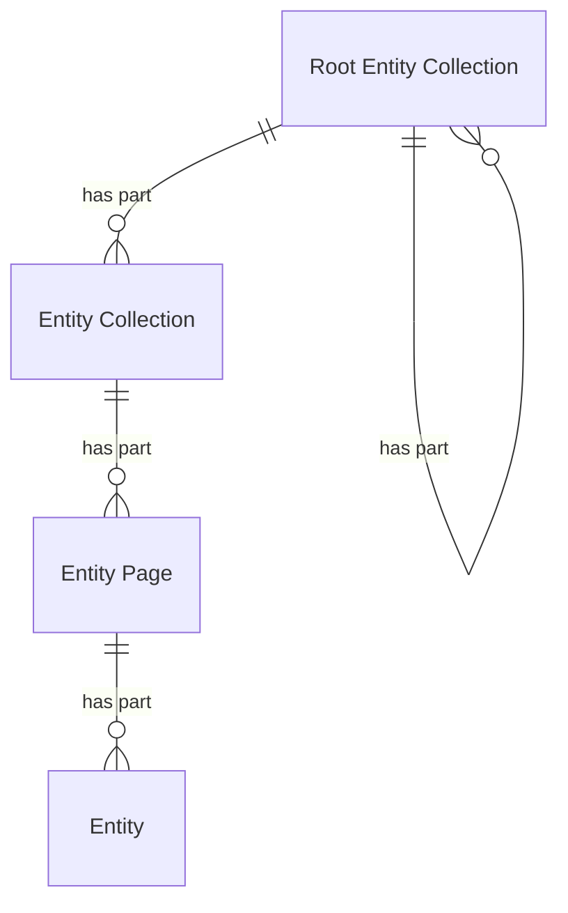

# Entities

## Introduction

An entity is an identifiable 'thing' relevant to heritage. For example: 'The Night Watch' (a painting), 'Rembrandt' (a person), 'Amsterdam' (a place) and 'Brabantine Gothic' (a concept) are all 'things'.

Entities are grouped into entity collections — groupings of entities of the same type. For example: all persons are a part of the 'persons' collection.

Entities can also be grouped into different types of collections. For example: 'The Night Watch' can be a part of the collection 'Masterpieces' and of the collection 'Paintings from the 17th century'. These collections are called heritage collections: selections of entities that are relevant to presentation layers. These differ from entity collections and are outlined on their [own page](heritage-collections.md).

## Entity types

An entity can be of any type. A data layer decides which types are relevant to its API and the presentation layers it serves.

For example, an API that exposes information about...

1. **all sorts of heritage objects** where the exact type does not matter, defines the generic entity type 'Heritage object';
1. **books** and **cars** defines the specific entity types 'Book' and 'Car';
1. **historical places** defines the specific entity types 'City', 'Town' and 'Hamlet';
1. **datasets** with heritage information defines the specific entity types 'Dataset' and 'Distribution'.

The following table provides examples of common entity types:

| Entity type name | Description                                                                |
| ---------------- | -------------------------------------------------------------------------- |
| Heritage object  | A valued object, e.g. a building, painting, book or document.              |
| Person           | A human being.                                                             |
| Organization     | An organized group of people.                                              |
| Place            | A spatial extent on the Earth's surface.                                   |
| Concept          | A unit of thought.                                                         |
| Event            | A thing that happened at a certain time and location.                      |
| Story            | An account of an event.                                                    |
| Dataset          | A collection of data, e.g. data about heritage objects.                    |
| Digital object   | A digital representation of an entity, e.g. an image of a heritage object. |

### Recommended data models for entity types

> [!NOTE]
> **To do**:
>
> - Describe the recommended data models (e.g. for a heritage object, a person, a place) using e.g. Schema.org concepts;
> - Explain data modeling requirements, e.g. each entity must refer to the data provider's publication system from which it came, and must have a license.
> - Move this section outside of the REST API documentation - it also applies to GraphQL?

## Data model

| Name                   | Description                                                                        |
| ---------------------- | ---------------------------------------------------------------------------------- |
| Root Entity Collection | A collection of entity collections.                                                |
| Entity Collection      | A collection of entities, pointing to entity pages containing the actual entities. |
| Entity Page            | A subcollection of entities, part of an entity collection.                         |
| Entity                 | An identifiable 'thing' relevant to heritage.                                      |

The following entity-relationship diagram visualizes the data model:



## Endpoint: Retrieve a root entity collection

The endpoint retrieves a root entity collection. The API _MUST_ implement this endpoint, even if the API supports just one entity collection.

An entity collection can serve as the root for nested entity collections. For example: an entity collection named 'Heritage objects' might have two entity collections as its members: a collection named 'Books' and a collection named 'Buildings'. It's up to the data layer to define the nesting of collections, depending on its situation.

This is a discovery endpoint: it allows presentation layers to identify the entity collections and their endpoint URIs.

### HTTP request

`GET /{version}/{entities}(/{...entities})`

### Path parameters

| Name          | Data type | Cardinality | Description                                                                    |
| ------------- | --------- | ----------- | ------------------------------------------------------------------------------ |
| `version`     | string    | 1           | The version of the API. Example: `v1`.                                         |
| `entities`    | string    | 1           | The path identifier of the top root entity collection. Example: `entities`.    |
| `...entities` | string    | 0 or more   | The path identifier(s) of further root entity collections. Example: `objects`. |

### Query parameters

None.

### Request body

None.

### Response body

The response body _MUST_ contain at least the following fields:

| Name            | Data type                              | Cardinality | Description                                                                                                          |
| --------------- | -------------------------------------- | ----------- | -------------------------------------------------------------------------------------------------------------------- |
| `id`            | string                                 | 1           | The identifier of the collection.                                                                                    |
| `type`          | string                                 | 1           | The type of the collection. It _MUST_ be `RootEntityCollection`.                                                     |
| `name`          | string                                 | 1           | A short, human-readable name of the collection.                                                                      |
| `totalItems`    | number                                 | 1           | The total number of entity collections in the collection.                                                            |
| `items`         | array                                  | 1           | A list of all entity collections. The API defines the order.                                                         |
| `items[*]`      | RootEntityCollection, EntityCollection | 1           | An entity collection.                                                                                                |
| `items[*].id`   | string                                 | 1           | The identifier of the entity collection.                                                                             |
| `items[*].type` | string                                 | 1           | The type of the entity collection. It _MUST_ be one of `RootEntityCollection`, `EntityCollection`.                   |
| `items[*].name` | string                                 | 1           | A short, human-readable name of the entity collection.                                                               |
| `partOf`        | RootEntityCollection                   | 0 or 1      | The root collection of which this collection is a part. Not set if this collection is the top-level root collection. |
| `partOf.id`     | string                                 | 1           | The identifier of the root collection.                                                                               |
| `partOf.type`   | string                                 | 1           | The type of the root collection. It _MUST_ be `RootEntityCollection`.                                                |

### Example

An example of the response body of the API:

```json
{
  "id": "https://example.org/v1/entities",
  "type": "RootEntityCollection",
  "name": "Entities",
  "totalItems": 2,
  "items": [
    {
      "id": "https://example.org/v1/entities/objects",
      "type": "RootEntityCollection",
      "name": "Heritage objects"
    },
    {
      "id": "https://example.org/v1/entities/persons",
      "type": "EntityCollection",
      "name": "Persons"
    }
  ]
}
```

The response indicates that the API has two entity collections that are a part of the root collection: one for 'Heritage objects' and one for 'Persons'.

An entity collection can also be a root collection for the entity collections within that collection. Example of the response body for the 'Heritage objects' collection:

```json
{
  "id": "https://example.org/v1/entities/objects",
  "type": "RootEntityCollection",
  "name": "Heritage objects",
  "totalItems": 2,
  "items": [
    {
      "id": "https://example.org/v1/entities/objects/books",
      "type": "EntityCollection",
      "name": "Books"
    },
    {
      "id": "https://example.org/v1/entities/objects/buildings",
      "type": "EntityCollection",
      "name": "Buildings"
    }
  ],
  "partOf": {
    "id": "https://example.org/v1/entities",
    "type": "RootEntityCollection"
  }
}
```

The response indicates that the 'Heritage objects' collection is a root collection and that it contains two entity collections: one for 'Books' and one for 'Buildings'.

## Endpoint: Retrieve an entity collection

The endpoint retrieves an entity collection.

### HTTP request

`GET /{version}/{entities}(/{...entities})/{entity}`

### Path parameters

| Name          | Data type | Cardinality | Description                                                                    |
| ------------- | --------- | ----------- | ------------------------------------------------------------------------------ |
| `version`     | string    | 1           | The version of the API. Example: `v1`.                                         |
| `entities`    | string    | 1           | The path identifier of the top root entity collection. Example: `entities`.    |
| `...entities` | string    | 0 or more   | The path identifier(s) of further root entity collections. Example: `objects`. |
| `entity`      | string    | 1           | The path identifier of the entity collection. Example: `books`.                |

### Query parameters

| Name      | Data type | Cardinality | Description                                                                                                                                                                                                    |
| --------- | --------- | ----------- | -------------------------------------------------------------------------------------------------------------------------------------------------------------------------------------------------------------- |
| `q`       | string    | 0 or 1      | A keyword query for filtering the entities. Minimum length: defined by the API (e.g. 1 character). Maximum length: defined by the API (e.g. 100 characters).                                                   |
| `size`    | number    | 0 or 1      | The maximum number of entities to retrieve. Minimum: 1. Default: 10. Maximum: defined by the API (e.g. 100).                                                                                                   |
| `orderBy` | string    | 0 or 1      | The sorting order of the entities. One of `relevance`, `value`. Default: `relevance:desc` (most relevant entity first). The API defines which value is used to sort by `value` (e.g. the `name` of an entity). |

### Request body

None.

### Response body

The response body _MUST_ contain at least the following fields:

| Name          | Data type            | Cardinality | Description                                                                                                                                                     |
| ------------- | -------------------- | ----------- | --------------------------------------------------------------------------------------------------------------------------------------------------------------- |
| `id`          | string               | 1           | The identifier of the collection.                                                                                                                               |
| `type`        | string               | 1           | The type of the collection. It _MUST_ be `EntityCollection`.                                                                                                    |
| `name`        | string               | 1           | A short, human-readable name of the collection.                                                                                                                 |
| `totalItems`  | number               | 0 or 1      | The total number of entities in the collection. May be an estimate. Not set if it is too costly to calculate.                                                   |
| `first`       | EntityPage           | 0 or 1      | The first page in the collection. Not set if the collection is empty.                                                                                           |
| `first.id`    | string               | 1           | The identifier of the first page in the collection.                                                                                                             |
| `first.type`  | string               | 1           | The type of the first page in the collection. It _MUST_ be `EntityPage`.                                                                                        |
| `last`        | EntityPage           | 0 or 1      | The last page in the collection. Not set if the collection is empty or the last page is unknown (e.g. in case of [cursor pagination](resources.md#pagination)). |
| `last.id`     | string               | 1           | The identifier of last page in the collection.                                                                                                                  |
| `last.type`   | string               | 1           | The type of the last page in the collection. It _MUST_ be `EntityPage`.                                                                                         |
| `partOf`      | RootEntityCollection | 1           | The root collection of which this collection is a part.                                                                                                         |
| `partOf.id`   | string               | 1           | The identifier of the root collection.                                                                                                                          |
| `partOf.type` | string               | 1           | The type of the root collection. It _MUST_ be `RootEntityCollection`.                                                                                           |

### Example

An example of the response body of the API:

```json
{
  "id": "https://example.org/v1/entities/objects",
  "type": "EntityCollection",
  "name": "Heritage objects",
  "totalItems": 195,
  "first": {
    "id": "https://example.org/v1/entities/objects?page=1",
    "type": "EntityPage"
  },
  "last": {
    "id": "https://example.org/v1/entities/objects?page=20",
    "type": "EntityPage"
  },
  "partOf": {
    "id": "https://example.org/v1/entities",
    "type": "RootEntityCollection"
  }
}
```

## Endpoint: Retrieve a page in an entity collection

The endpoint retrieves a page in an entity collection. The API _MUST_ implement this endpoint.

### HTTP request

`GET /{version}/{entities}(/{...entities})/{entity}?page={page}`

### Path parameters

| Name          | Data type | Cardinality | Description                                                                    |
| ------------- | --------- | ----------- | ------------------------------------------------------------------------------ |
| `version`     | string    | 1           | The version of the API. Example: `v1`.                                         |
| `entities`    | string    | 1           | The path identifier of the top root entity collection. Example: `entities`.    |
| `...entities` | string    | 0 or more   | The path identifier(s) of further root entity collections. Example: `objects`. |
| `entity`      | string    | 1           | The path identifier of the entity collection. Example: `books`.                |

### Query parameters

| Name      | Data type | Cardinality | Description                                                                                                                                                                                                    |
| --------- | --------- | ----------- | -------------------------------------------------------------------------------------------------------------------------------------------------------------------------------------------------------------- |
| `page`    | string    | 1           | The identifier of the page: a page number or cursor, depending on the [pagination strategy](resources.md#pagination) of the API.                                                                               |
| `q`       | string    | 0 or 1      | A keyword query for filtering the entities. Minimum length: defined by the API (e.g. 1 character). Maximum length: defined by the API (e.g. 100 characters).                                                   |
| `size`    | number    | 0 or 1      | The maximum number of entities to retrieve. Minimum: 1. Default: 10. Maximum: defined by the API (e.g. 100).                                                                                                   |
| `orderBy` | string    | 0 or 1      | The sorting order of the entities. One of `relevance`, `value`. Default: `relevance:desc` (most relevant entity first). The API defines which value is used to sort by `value` (e.g. the `name` of an entity). |

### Request body

None.

### Response body

The response body _MUST_ contain at least the following fields:

| Name        | Data type        | Cardinality | Description                                                                                                                                                         |
| ----------- | ---------------- | ----------- | ------------------------------------------------------------------------------------------------------------------------------------------------------------------- |
| `id`        | string           | 1           | The identifier of the current page.                                                                                                                                 |
| `type`      | string           | 1           | The type of the page. It _MUST_ be `EntityPage`.                                                                                                                    |
| `name`      | string           | 1           | A short, human-readable name of the page.                                                                                                                           |
| `items`     | array            | 1           | A list of entities.                                                                                                                                                 |
| `items[*]`  | Entity           | 1           | An entity. All fields of an entity _MUST_ be embedded. See the response body of endpoint [Retrieve an entity](#endpoint-retrieve-an-entity).                        |
| `prev`      | EntityPage       | 0 or 1      | The previous page in the collection. Not set if there is no previous page.                                                                                          |
| `prev.id`   | string           | 1           | The identifier of the previous page in the collection.                                                                                                              |
| `prev.type` | string           | 1           | The type of the previous page in the collection. It _MUST_ be `EntityPage`.                                                                                         |
| `next`      | EntityPage       | 0 or 1      | The next page in the collection. Not set if there is no next page.                                                                                                  |
| `next.id`   | string           | 1           | The identifier of the next page in the collection.                                                                                                                  |
| `next.type` | string           | 1           | The type of the next page in the collection. It _MUST_ be `EntityPage`.                                                                                             |
| `partOf`    | EntityCollection | 1           | The collection of which this page is a part. See the response body of endpoint [Retrieve an entity collection](entities.md#endpoint-retrieve-an-entity-collection). |

### Example

An example of the response body:

```json
{
  "id": "https://example.org/v1/entities/objects?page=3",
  "type": "EntityPage",
  "name": "Heritage objects",
  "items": [
    {
      "id": "https://example.org/v1/entities/objects/1234",
      "type": "HeritageObject",
      "name": "The Night Watch"
      // Other fields...
    },
    {
      "id": "https://example.org/v1/entities/objects/5678",
      "type": "HeritageObject",
      "name": "Ford V8 Cabriolet"
      // Other fields...
    }
    // Other items...
  ],
  "prev": {
    "id": "https://example.org/v1/entities/objects?page=2",
    "type": "EntityPage"
  },
  "next": {
    "id": "https://example.org/v1/entities/objects?page=4",
    "type": "EntityPage"
  },
  "partOf": {
    // Omitted for brevity — see the response body of endpoint
    // "Retrieve an entity collection"
  }
}
```

## Endpoint: Retrieve an entity

The endpoint retrieves an entity. The API _MUST_ implement this endpoint.

### HTTP request

`GET /{version}/{entities}(/{...entities})/{entity}/{id}`

### Path parameters

| Name          | Data type | Cardinality | Description                                                                    |
| ------------- | --------- | ----------- | ------------------------------------------------------------------------------ |
| `version`     | string    | 1           | The version of the API. Example: `v1`.                                         |
| `entities`    | string    | 1           | The path identifier of the top root entity collection. Example: `entities`.    |
| `...entities` | string    | 0 or more   | The path identifier(s) of further root entity collections. Example: `objects`. |
| `entity`      | string    | 1           | The path identifier of the entity collection. Example: `books`.                |
| `id`          | string    | 1           | The path identifier of the entity.                                             |

### Query parameters

None.

### Request body

None.

### Response body

The response body _MUST_ contain at least the fields underneath. Additional fields depend on the data model of the entity, defined by the API.

| Name   | Data type | Cardinality | Description                                        |
| ------ | --------- | ----------- | -------------------------------------------------- |
| `id`   | string    | 1           | The identifier of the entity. It _MUST_ be an URI. |
| `type` | string    | 1           | The type of the entity.                            |
| `name` | string    | 1           | The name of the entity.                            |

### Example

An example request from a presentation layer:

```http
GET /v1/entities/objects/1234 HTTP/2
Host: example.org
```

The request indicates that the API should return an entity in a specific collection (`objects`) with ID `1234`.

The response body depends on the data model of the entity. An example:

```json
{
  "id": "https://example.org/v1/entities/objects/1234",
  "type": "HeritageObject",
  "name": "The Night Watch",
  "additionalTypes": [
    {
      "id": "https://example.org/v1/entities/concepts/1122",
      "type": "Concept",
      "name": "Painting"
    }
  ],
  "description": "Rembrandt’s largest, most famous canvas was made for the Arquebusiers guild hall...",
  "dateCreated": "1642",
  "creators": [
    {
      "id": "https://example.org/v1/entities/persons/5678",
      "type": "Person",
      "name": "Rembrandt"
    }
  ],
  "locationsCreated": [
    {
      "id": "https://example.org/v1/entities/places/9012",
      "type": "Place",
      "name": "Amsterdam"
    }
  ]
  // Other fields...
}
```

The response indicates that this entity is a type of 'Heritage object' with name 'The Night Watch'. It is linked to other entities of types 'Concept', 'Person' and 'Place'.
