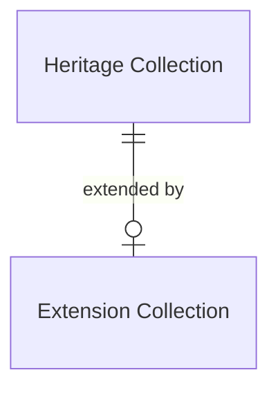

# Extensions

## Introduction

An extension is a resource that supplements a heritage collection with additional functionality. This specification defines two core extensions: [Facets](facets.md) and [Suggestions](suggestions.md). A data layer may also implement its own custom extensions for specific use cases.

An extension is supplementary and, therefore, _OPTIONAL_. It's up to a data layer to decide whether or not to implement one.

> [!NOTE]
> **To be discussed**: generalize the notion of extensions to, for example, 'capabilities'? See for example search result highlighting, the visual technique that wraps matching query words in HTML tags (like `<em>` or `<mark>`), showing users why a result matches their input. Is there a way to define this functionality as an extension according to the rules on this page, or should it be defined in a different way?

## Data model

| Name                 | Description                                                                           |
| -------------------- | ------------------------------------------------------------------------------------- |
| Heritage Collection  | A collection of entities.                                                             |
| Extension Collection | A collection of extensions, adding additional functionality to a heritage collection. |

The following entity-relationship diagram visualizes the data model:



> [!NOTE]
> **To be discussed**: replace the ER diagram with a class diagram to make the relationships clearer (e.g. inheritance).

## Endpoint: Retrieve the extension collection of a heritage collection

The endpoint retrieves the extension collection belonging to a heritage collection. The API _MUST_ implement this endpoint if it supports extensions.

This is a discovery endpoint: it allows presentation layers to identify the extensions and their endpoint URIs.

### HTTP request

`GET /{version}/{collections}(/{...collections})/{collection}/{extensions}`

### Path parameters

| Name             | Data type | Cardinality | Description                                                                      |
| ---------------- | --------- | ----------- | -------------------------------------------------------------------------------- |
| `version`        | string    | 1           | The version of the API. Example: `v1`.                                           |
| `collections`    | string    | 1           | The path identifier of the top root heritage collection. Example: `collections`. |
| `...collections` | string    | 0 or more   | The path identifier(s) of further root heritage collections. Example: `objects`. |
| `collection`     | string    | 1           | The path identifier of the heritage collection. Example: `masterpieces`.         |
| `extensions`     | string    | 1           | The path identifier of the extension collection. Example: `extensions`.          |

### Query parameters

None.

### Request body

None.

### Response body

The response body _MUST_ contain at least the following fields:

| Name            | Data type          | Cardinality | Description                                                                                                           |
| --------------- | ------------------ | ----------- | --------------------------------------------------------------------------------------------------------------------- |
| `id`            | string             | 1           | The identifier of the collection.                                                                                     |
| `type`          | string             | 1           | The type of the collection. It _MUST_ be `ExtensionCollection`.                                                       |
| `name`          | string             | 1           | A short, human-readable name of the collection.                                                                       |
| `totalItems`    | number             | 1           | The total number of extensions in the collection.                                                                     |
| `items`         | array              | 1           | A list of all extensions. The API defines the order.                                                                  |
| `items[*]`      | resource           | 1           | An extension. This may be any resource.                                                                               |
| `items[*].id`   | string             | 1           | The identifier of the extension.                                                                                      |
| `items[*].type` | string             | 1           | The type of the extension. This may be any type. Core types are `RootFacetCollection` and `RootSuggestionCollection`. |
| `items[*].name` | string             | 1           | A short, human-readable name of the extension.                                                                        |
| `extends`       | HeritageCollection | 1           | The heritage collection that is extended by this collection.                                                          |
| `extends.id`    | string             | 1           | The identifier of the heritage collection.                                                                            |
| `extends.type`  | string             | 1           | The type of the heritage collection. It _MUST_ be `HeritageCollection`.                                               |

### Example

An example request from a presentation layer:

```http
GET /v1/collections/objects/extensions HTTP/2
Host: example.org
```

The request indicates that the API should return the extension collection belonging to a heritage collection (`objects`).

An example of the response body of the API:

```json
{
  "id": "https://example.org/v1/collections/objects/extensions",
  "type": "ExtensionCollection",
  "name": "Extensions",
  "totalItems": 2,
  "items": [
    {
      "id": "https://example.org/v1/collections/objects/extensions/facets",
      "type": "RootFacetCollection",
      "name": "Facets"
    },
    {
      "id": "https://example.org/v1/collections/objects/extensions/suggestions",
      "type": "RootSuggestionCollection",
      "name": "Suggestions"
    }
  ],
  "extends": {
    "id": "https://example.org/v1/collections/objects",
    "type": "HeritageCollection"
  }
}
```

The response indicates that a heritage collection (`objects`) has two extensions: a Root Facet Collection and a Root Suggestion Collection. The presentation layer can use this information to dynamically create a user interface and offer specific functionality to users.
