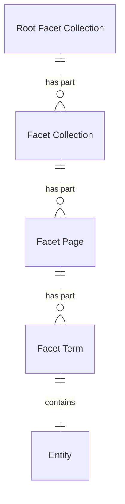

# Facets

## Introduction

A facet is a collection of categorized values to narrow down search results. For example, the creators of heritage objects can be organized into a 'Creator' facet.

Facets are tied to a [heritage collection](heritage-collections.md): they are returned in response to a search for entities in a specific collection and do not exist on their own.

Facets are an _OPTIONAL_ [extension](extensions.md). A data layer may choose whether or not to implement them.

> [!NOTE]
> **To do**: clarify the facet functionality: presentation layers not only want to retrieve the facets, they also want to be able to search and browse facets.

## Facets

The data layer determines which facets to support. This specification does not require any specific facets.

For example, an API that exposes information about...

1. **paintings** defines the facet 'Technique', to categorize the techniques used for creating the works of art;
1. **military personnel** defines the facet 'Military rank', to categorize the ranks of the persons;
1. **cars** defines the facet 'Color', to categorize the primary colors of the cars.

The following table lists some common facets:

**For heritage objects**:

| Facet name      | Description                                                                                                         |
| --------------- | ------------------------------------------------------------------------------------------------------------------- |
| Type            | The types of heritage objects, e.g. 'Building', 'Painting'.                                                         |
| Creator         | The creators of heritage objects, e.g. 'Vincent van Gogh', 'Rembrandt'.                                             |
| Made in century | The dates of creation of heritage objects grouped by century, e.g. '17th century', '18th century'.                  |
| Made in place   | The places of creation of heritage objects, e.g. 'Amsterdam', 'The Hague'.                                          |
| Publisher       | The heritage institutions that publish information about heritage objects, e.g. 'Rijksmuseum', 'National Archives'. |

**For persons**:

| Facet name     | Description                                                                                                |
| -------------- | ---------------------------------------------------------------------------------------------------------- |
| Place of birth | The places of birth of persons, e.g. 'Amsterdam', 'The Hague'.                                             |
| Occupation     | The occupations of persons, e.g. 'Blacksmith', 'Mayor'.                                                    |
| Publisher      | The heritage institutions that publish information about persons, e.g. 'Rijksmuseum', 'National Archives'. |

## Data model

| Name                  | Description                                                                               |
| --------------------- | ----------------------------------------------------------------------------------------- |
| Root Facet Collection | A collection of facet collections.                                                        |
| Facet Collection      | A collection of categorized values, pointing to facet pages containing the actual values. |
| Facet Page            | A subcollection of categorized values, part of a facet collection.                        |
| Facet Term            | A selectable option within a facet page, pointing to an entity.                           |
| Entity                | An identifiable 'thing' relevant to heritage. See [Entities](entities.md).                |

The following entity-relationship diagram visualizes the data model:



> [!NOTE]
> **To be discussed**: replace the ER diagram with a class diagram to make the relationships clearer (e.g. inheritance).

## Identification of facet items

> [!NOTE]
> **To do**: explain how facet items can be identified:
>
> - **By ID**. For example: the name 'Jan de Vries' can be ambiguous in the 'Creator' facet; there can be several persons with that name. If the data layer intends to resolve this, it should identify items by their ID (e.g. `https://example.org/v1/entities/persons/1234`), to make clear the item is about a specific person, regardless of the name of the person.
> - **By name or label**. For example: the name 'Jan de Vries' can be ambiguous in the 'Creator' facet. The data layer may decide to not resolve this: identification by ID could mean that several items with the same name appear in the facet list ('Jan de Vries', 'Jan de Vries', 'Jan de Vries'), each with an ID that a user in the presentation layer does not see and/or can interpret. In that case the data layer may identify items by their name, causing distinct persons with the same name to be grouped in one facet item ('Jan de Vries').

## Endpoint: Retrieve a root facet collection

The endpoint retrieves the facet collections belonging to a heritage collection. The API _MUST_ implement this endpoint if it supports facets.

This is a discovery endpoint: it allows presentation layers to identify the facet collections and their endpoint URIs.

### HTTP request

`GET /{version}/{collections}(/{...collections})/{collection}/{extensions}/{facets}`

### Path parameters

| Name             | Data type | Cardinality | Description                                                                      |
| ---------------- | --------- | ----------- | -------------------------------------------------------------------------------- |
| `version`        | string    | 1           | The version of the API. Example: `v1`.                                           |
| `collections`    | string    | 1           | The path identifier of the top root heritage collection. Example: `collections`. |
| `...collections` | string    | 0 or more   | The path identifier(s) of further root heritage collections. Example: `objects`. |
| `collection`     | string    | 1           | The path identifier of the heritage collection. Example: `masterpieces`.         |
| `extensions`     | string    | 1           | The path identifier of the extension collection. Example: `extensions`.          |
| `facets`         | string    | 1           | The path identifier of the root facet collection. Example: `facets`.             |

### Query parameters

None.

### Request body

None.

### Response body

The response body _MUST_ contain at least the following fields:

| Name            | Data type           | Cardinality | Description                                                               |
| --------------- | ------------------- | ----------- | ------------------------------------------------------------------------- |
| `id`            | string              | 1           | The identifier of the collection.                                         |
| `type`          | string              | 1           | The type of the collection. It _MUST_ be `RootFacetCollection`.           |
| `name`          | string              | 1           | A short, human-readable name of the collection.                           |
| `totalItems`    | number              | 1           | The total number of facets in the collection.                             |
| `items`         | array               | 1           | A list of all facet collections. The API defines the order.               |
| `items[*]`      | FacetCollection     | 1           | A facet collection.                                                       |
| `items[*].id`   | string              | 1           | The identifier of the facet collection.                                   |
| `items[*].type` | string              | 1           | The type of the facet collection. It _MUST_ be `FacetCollection`.         |
| `items[*].name` | string              | 1           | A short, human-readable name of the facet collection.                     |
| `partOf`        | ExtensionCollection | 1           | The extension collection of which this extension is a part.               |
| `partOf.id`     | string              | 1           | The identifier of the extension collection.                               |
| `partOf.type`   | string              | 1           | The type of the extension collection. It _MUST_ be `ExtensionCollection`. |

### Example

An example request from a presentation layer:

```http
GET /v1/collections/objects/extensions/facets HTTP/2
Host: example.org
```

The request indicates that the API should return the root facet collection of a heritage collection (`objects`).

An example of the response body of the API:

```json
{
  "id": "https://example.org/v1/collections/objects/extensions/facets",
  "type": "RootFacetCollection",
  "name": "Facets",
  "totalItems": 2,
  "items": [
    {
      "id": "https://example.org/v1/collections/objects/extensions/facets/centuries",
      "type": "FacetCollection",
      "name": "Made in century"
    },
    {
      "id": "https://example.org/v1/collections/objects/extensions/facets/creators",
      "type": "FacetCollection",
      "name": "Creator"
    }
  ],
  "partOf": {
    "id": "https://example.org/v1/collections/objects/extensions",
    "type": "ExtensionCollection"
  }
}
```

The response indicates that the API has two facet collections that are a part of the root collection: 'Made in century' and 'Creator'.

## Endpoint: Retrieve a facet collection

The endpoint retrieves a facet collection. The API _MUST_ implement this endpoint if it supports facets.

### HTTP request

`GET /{version}/{collections}(/{...collections})/{collection}/{extensions}/{facets}/{facet}`

### Path parameters

| Name             | Data type | Cardinality | Description                                                                      |
| ---------------- | --------- | ----------- | -------------------------------------------------------------------------------- |
| `version`        | string    | 1           | The version of the API. Example: `v1`.                                           |
| `collections`    | string    | 1           | The path identifier of the top root heritage collection. Example: `collections`. |
| `...collections` | string    | 0 or more   | The path identifier(s) of further root heritage collections. Example: `objects`. |
| `collection`     | string    | 1           | The path identifier of the heritage collection. Example: `masterpieces`.         |
| `extensions`     | string    | 1           | The path identifier of the extension collection. Example: `extensions`.          |
| `facets`         | string    | 1           | The path identifier of the root facet collection. Example: `facets`.             |
| `facet`          | string    | 1           | The path identifier of the facet collection. Example: `creators`, `centuries`.   |

### Query parameters

| Name      | Data type | Cardinality | Description                                                                                                                                                                                             |
| --------- | --------- | ----------- | ------------------------------------------------------------------------------------------------------------------------------------------------------------------------------------------------------- |
| `q`       | string    | 0 or 1      | A keyword query for filtering the facet terms. Minimum length: defined by the data layer (e.g. 3 characters). Maximum length: defined by the API (e.g. 25 characters).                                  |
| `size`    | number    | 0 or 1      | The maximum number of facet terms to retrieve. Minimum: 1. Default: 10. Maximum: defined by the API (e.g. 100).                                                                                         |
| `orderBy` | string    | 0 or 1      | The sorting order of the facet terms. One of `count`, `value`. Default: `count:desc` (most frequent term first). The API defines which value is used to sort by `value` (e.g. the `name` of an entity). |

> [!NOTE]
> **To do**: add the query parameters representing the "search context" from the heritage collection (`q` and `filter` from endpoint [Retrieve a page in a heritage collection](#endpoint-retrieve-a-page-in-a-heritage-collection)).

### Request body

None.

### Response body

The response body _MUST_ contain at least the following fields:

| Name          | Data type           | Cardinality | Description                                                                                                                                                        |
| ------------- | ------------------- | ----------- | ------------------------------------------------------------------------------------------------------------------------------------------------------------------ |
| `id`          | string              | 1           | The identifier of the collection.                                                                                                                                  |
| `type`        | string              | 1           | The type of the collection. It _MUST_ be `FacetCollection`.                                                                                                        |
| `name`        | string              | 1           | A short, human-readable name of the collection.                                                                                                                    |
| `totalItems`  | number              | 0 or 1      | The total number of facet terms in the collection. May be an estimate. Not set if it is too costly to calculate.                                                   |
| `first`       | FacetPage           | 0 or 1      | The first page in the collection. Not set if the collection is empty.                                                                                              |
| `first.id`    | string              | 1           | The identifier of the first page in the collection.                                                                                                                |
| `first.type`  | string              | 1           | The type of the first page in the collection. It _MUST_ be `FacetPage`.                                                                                            |
| `last`        | FacetPage           | 0 or 1      | The last page in the collection. Not set if the collection is empty or if the last page is unknown (e.g. in case of [cursor pagination](resources.md#pagination)). |
| `last.id`     | string              | 1           | The identifier of the last page in the collection.                                                                                                                 |
| `last.type`   | string              | 1           | The type of the last page in the collection. It _MUST_ be `FacetPage`.                                                                                             |
| `partOf`      | RootFacetCollection | 1           | The root facet collection of which this facet collection is a part.                                                                                                |
| `partOf.id`   | string              | 1           | The identifier of the root facet collection.                                                                                                                       |
| `partOf.type` | string              | 1           | The type of the root facet collection. It _MUST_ be `RootFacetCollection`.                                                                                         |

### Example

An example request from a presentation layer:

```http
GET /v1/collections/objects/extensions/facets/creators HTTP/2
Host: example.org
```

The request indicates that the API should return a facet collection (`creators`) of a heritage collection (`objects`).

An example of the response body of the API:

```json
{
  "id": "https://example.org/v1/collections/objects/extensions/facets/creators",
  "type": "FacetCollection",
  "name": "Creator",
  "totalItems": 195,
  "first": {
    "id": "https://example.org/v1/collections/objects/extensions/facets/creators?page=1",
    "type": "FacetPage"
  },
  "last": {
    "id": "https://example.org/v1/collections/objects/extensions/facets/creators?page=20",
    "type": "FacetPage"
  },
  "partOf": {
    "id": "https://example.org/v1/collections/objects/extensions/facets",
    "type": "RootFacetCollection"
  }
}
```

## Endpoint: Retrieve a page in a facet collection

The endpoint retrieves a page in a facet collection. The API _MUST_ implement this endpoint if it supports facets.

### HTTP request

`GET /{version}/{collections}(/{...collections})/{collection}/{extensions}/{facets}/{facet}?page={page}`

### Path parameters

| Name             | Data type | Cardinality | Description                                                                      |
| ---------------- | --------- | ----------- | -------------------------------------------------------------------------------- |
| `version`        | string    | 1           | The version of the API. Example: `v1`.                                           |
| `collections`    | string    | 1           | The path identifier of the top root heritage collection. Example: `collections`. |
| `...collections` | string    | 0 or more   | The path identifier(s) of further root heritage collections. Example: `objects`. |
| `collection`     | string    | 1           | The path identifier of the heritage collection. Example: `masterpieces`.         |
| `extensions`     | string    | 1           | The path identifier of the extension collection. Example: `extensions`.          |
| `facets`         | string    | 1           | The path identifier of the root facet collection. Example: `facets`.             |
| `facet`          | string    | 1           | The path identifier of the facet collection. Example: `creators`, `centuries`.   |

### Query parameters

| Name      | Data type | Cardinality | Description                                                                                                                                                                                             |
| --------- | --------- | ----------- | ------------------------------------------------------------------------------------------------------------------------------------------------------------------------------------------------------- |
| `page`    | string    | 1           | The identifier of the page: a page number or cursor, depending on the [pagination strategy](resources.md#pagination) of the API.                                                                        |
| `q`       | string    | 0 or 1      | A keyword query for filtering the facet terms. Minimum length: defined by the data layer (e.g. 3 characters). Maximum length: defined by the API (e.g. 25 characters).                                  |
| `size`    | number    | 0 or 1      | The maximum number of facet terms to retrieve. Minimum: 1. Default: 10. Maximum: defined by the API (e.g. 100).                                                                                         |
| `orderBy` | string    | 0 or 1      | The sorting order of the facet terms. One of `count`, `value`. Default: `count:desc` (most frequent term first). The API defines which value is used to sort by `value` (e.g. the `name` of an entity). |

> [!NOTE]
> **To do**: add the query parameters representing the "search context" from the heritage collection (`q` and `filter` from endpoint [Retrieve a page in a heritage collection](#endpoint-retrieve-a-page-in-a-heritage-collection)).

### Request body

None.

### Response body

The response body _MUST_ contain at least the following fields:

| Name                  | Data type       | Cardinality | Description                                                                                                                                          |
| --------------------- | --------------- | ----------- | ---------------------------------------------------------------------------------------------------------------------------------------------------- |
| `id`                  | string          | 1           | The identifier of the current page.                                                                                                                  |
| `type`                | string          | 1           | The type of the page. It _MUST_ be `FacetPage`.                                                                                                      |
| `name`                | string          | 1           | A short, human-readable name of the page.                                                                                                            |
| `items`               | array           | 1           | A list of facet terms.                                                                                                                               |
| `items[*]`            | FacetTerm       | 1           | A facet term.                                                                                                                                        |
| `items[*].type`       | string          | 1           | The type of the facet term. It _MUST_ be `FacetTerm`.                                                                                                |
| `items[*].count`      | number          | 1           | The number of occurrences of the value of the facet term.                                                                                            |
| `items[*].value`      | Entity          | 1           | The value of the facet term.                                                                                                                         |
| `items[*].value.type` | string          | 1           | The type of the value of the facet term. It _MUST_ be a type of `Entity`.                                                                            |
| `items[*].value.id`   | string          | 1           | The identifier of the value of the facet term.                                                                                                       |
| `items[*].value.name` | string          | 1           | The name of the value of the facet term.                                                                                                             |
| `prev`                | FacetPage       | 0 or 1      | The previous page in the collection. Not set if there is no previous page.                                                                           |
| `prev.id`             | string          | 1           | The identifier of the previous page in the collection.                                                                                               |
| `prev.type`           | string          | 1           | The type of the previous page in the collection. It _MUST_ be `FacetPage`.                                                                           |
| `next`                | FacetPage       | 0 or 1      | The next page in the collection. Not set if there is no next page.                                                                                   |
| `next.id`             | string          | 1           | The identifier of the next page in the collection.                                                                                                   |
| `next.type`           | string          | 1           | The type of the next page in the collection. It _MUST_ be `FacetPage`.                                                                               |
| `partOf`              | FacetCollection | 1           | The collection of which this page is a part. See the response body of endpoint [Retrieve a facet collection](#endpoint-retrieve-a-facet-collection). |

### Example

An example request from a presentation layer:

```http
GET /v1/collections/objects/extensions/facets/creators?page=3 HTTP/2
Host: example.org
```

The request indicates that the API should return page 3 in a facet collection (`creators`) of a heritage collection (`objects`).

An example of the response body of the API:

```json
{
  "id": "https://example.org/v1/collections/objects/extensions/facets/creators?page=3",
  "type": "FacetPage",
  "name": "Creator",
  "items": [
    {
      "type": "FacetTerm",
      "count": 12,
      "value": {
        "id": "https://example.org/v1/entities/persons/1234",
        "type": "Person",
        "name": "Arno Haag"
        // Optionally: other fields...
      }
    },
    {
      "type": "FacetTerm",
      "count": 8,
      "value": {
        "id": "https://example.org/v1/entities/persons/5678",
        "type": "Person",
        "name": "Hans de Haan"
        // Optionally: other fields...
      }
    }
    // Other items...
  ],
  "prev": {
    "id": "https://example.org/v1/collections/objects/extensions/facets/creators?page=2",
    "type": "FacetPage"
  },
  "next": {
    "id": "https://example.org/v1/collections/objects/extensions/facets/creators?page=4",
    "type": "FacetPage"
  },
  "partOf": {
    // Omitted for brevity — see the response body of endpoint
    // "Retrieve a facet collection"
  }
}
```
