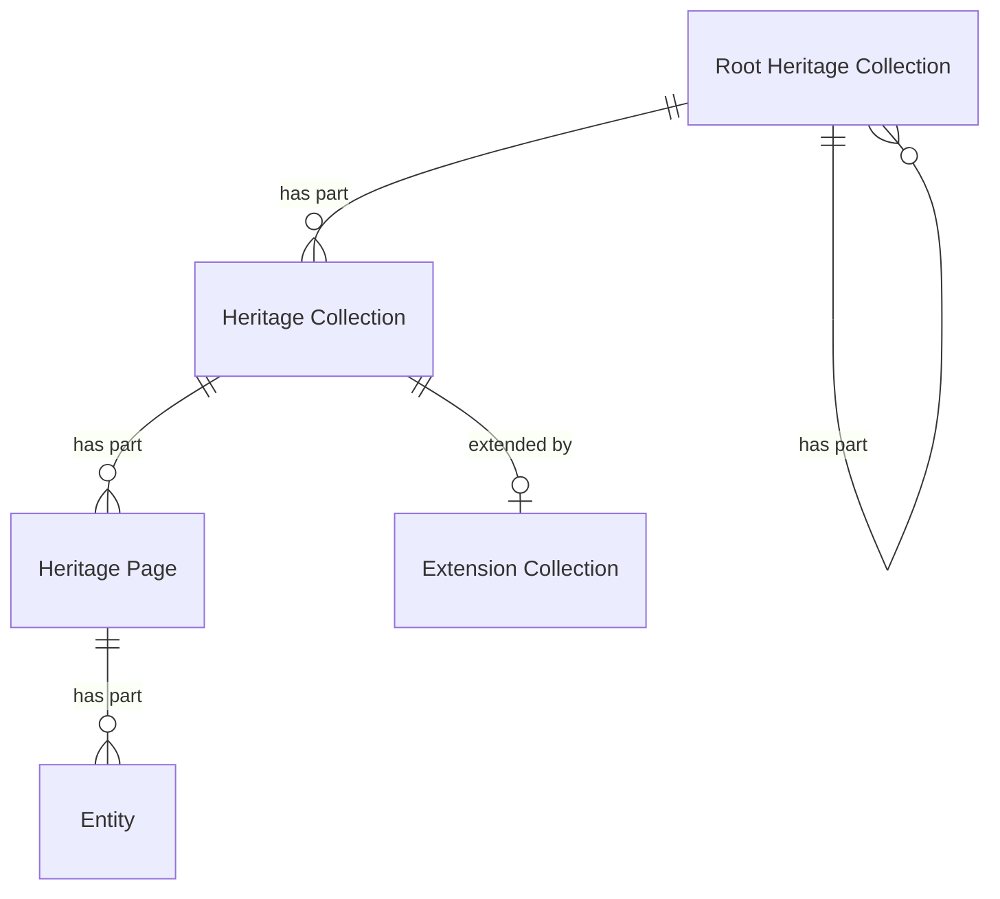

# Heritage Collections

## Introduction

A heritage collection is a grouping of [entities](entities.md) that is meaningful to presentation layers. A data layer can include any entity of any type in a heritage collection. A data layer can also create any number of heritage collections, nested in any way, depending on the requirements of presentation layers.

For example: a data layer may have one heritage collection for all entities of type 'heritage object' — the full collection. The data layer may also have a 'Masterpieces' heritage collection, with a selection of the finest entities from the full collection. The data layer may also have a 'Great for kids' heritage collection, with a selection of the entities from the full collection that are interesting for children.

A data layer may add extra functionality to a heritage collection. For example: users of a presentation layer may want to find entities in the 'Masterpieces' collection using faceted search. Such add-on functionality can be defined as an [extension](extensions.md).

## Data model

| Name                     | Description                                                                          |
| ------------------------ | ------------------------------------------------------------------------------------ |
| Root Heritage Collection | A collection of heritage collections.                                                |
| Heritage Collection      | A collection of entities, pointing to heritage pages containing the actual entities. |
| Heritage Page            | A subcollection of entities, part of a heritage collection.                          |
| Entity                   | An identifiable 'thing' relevant to heritage. See [Entities](entities.md).           |
| Extension Collection     | A collection of extensions, adding extra functionality to a heritage collection.     |

The following entity-relationship diagram visualizes the data model:



> [!NOTE]
> **To be discussed**: replace the ER diagram with a class diagram to make the relationships clearer (e.g. inheritance).

## Filter types

Entities in a heritage collection can be filtered to narrow down results. Supported filter types are:

1. **Keyword filter**: filtering based on text matching (e.g. `Rem`, `Rem*`, `'Vincent van Gogh'`)
1. **Date or numeric filter**: filtering by comparing date or numeric values (e.g. 'Date of creation is between 1900 and 1950').
1. **Geolocation filter**: filtering based on coordinates and radius (e.g. 'Location of creation is within 25 km of a geopoint').
1. **Facet filter**: filtering by specific attributes or categories (e.g. 'Creator is "Rembrandt" or "Vincent van Gogh" and Type is "Painting"').

The data layer decides which filters should be implemented in its API. The data layer can also add its own, custom filters, for specific use cases.

> [!NOTE]
> **To do**: this section needs more explanation.

## Endpoint: Retrieve a root heritage collection

The endpoint retrieves a root heritage collection. The API _MUST_ implement this endpoint, even if the API does not provide heritage collections or supports just one.

A heritage collection can serve as the root for nested heritage collections. For example: a heritage collection named 'Persons' might have two heritage collections as its members: a collection named 'Painters' and a collection named 'Writers'. It's up to the data layer to define the nesting of collections, depending on its situation.

This is a discovery endpoint: it allows presentation layers to identify the heritage collections and their endpoint URIs.

### HTTP request

`GET /{version}/{collections}(/{...collections})`

### Path parameters

| Name             | Data type | Cardinality | Description                                                                      |
| ---------------- | --------- | ----------- | -------------------------------------------------------------------------------- |
| `version`        | string    | 1           | The version of the API. Example: `v1`.                                           |
| `collections`    | string    | 1           | The path identifier of the top root heritage collection. Example: `collections`. |
| `...collections` | string    | 0 or more   | The path identifier(s) of further root heritage collections. Example: `objects`. |

### Query parameters

None.

### Request body

None.

### Response body

The response body _MUST_ contain at least the following fields:

| Name            | Data type                                  | Cardinality | Description                                                                                                          |
| --------------- | ------------------------------------------ | ----------- | -------------------------------------------------------------------------------------------------------------------- |
| `id`            | string                                     | 1           | The identifier of the collection.                                                                                    |
| `type`          | string                                     | 1           | The type of the collection. It _MUST_ be `RootHeritageCollection`.                                                   |
| `name`          | string                                     | 1           | A short, human-readable name of the collection.                                                                      |
| `totalItems`    | number                                     | 1           | The total number of heritage collections in the collection.                                                          |
| `items`         | array                                      | 1           | A list of all heritage collections. The API defines the order.                                                       |
| `items[*]`      | RootHeritageCollection, HeritageCollection | 1           | A heritage collection.                                                                                               |
| `items[*].id`   | string                                     | 1           | The identifier of the heritage collection.                                                                           |
| `items[*].type` | string                                     | 1           | The type of the heritage collection. It _MUST_ be one of `RootHeritageCollection`, `HeritageCollection`.             |
| `items[*].name` | string                                     | 1           | A short, human-readable name of the heritage collection.                                                             |
| `partOf`        | RootHeritageCollection                     | 0 or 1      | The root collection of which this collection is a part. Not set if this collection is the top-level root collection. |
| `partOf.id`     | string                                     | 1           | The identifier of the root collection.                                                                               |
| `partOf.type`   | string                                     | 1           | The type of the root collection. It _MUST_ be `RootHeritageCollection`.                                              |

### Example

An example of the response body of the API:

```json
{
  "id": "https://example.org/v1/collections",
  "type": "RootHeritageCollection",
  "name": "Collections",
  "totalItems": 2,
  "items": [
    {
      "id": "https://example.org/v1/collections/masterpieces",
      "type": "HeritageCollection",
      "name": "Collection with masterpieces"
    },
    {
      "id": "https://example.org/v1/collections/persons",
      "type": "RootHeritageCollection",
      "name": "Collection with persons"
    }
  ]
}
```

The response indicates that the API has two heritage collections that are a part of the root collection: one for 'Masterpieces' and one for 'Persons'.

A heritage collection can be a root for nested collections. Example response for the 'Persons' collection:

```json
{
  "id": "https://example.org/v1/collections/persons",
  "type": "RootHeritageCollection",
  "name": "Collection with persons",
  "totalItems": 2,
  "items": [
    {
      "id": "https://example.org/v1/collections/persons/painters",
      "type": "HeritageCollection",
      "name": "Collection with painters"
    },
    {
      "id": "https://example.org/v1/collections/persons/writers",
      "type": "HeritageCollection",
      "name": "Collection with writers"
    }
  ],
  "partOf": {
    "id": "https://example.org/v1/collections",
    "type": "RootHeritageCollection"
  }
}
```

The response indicates that the 'Persons' collection is a root collection and that it contains two heritage collections: one for 'Painters' and one for 'Writers'.

## Endpoint: Retrieve a heritage collection

The endpoint retrieves a heritage collection.

### HTTP request

`GET /{version}/{collections}(/{...collections})/{collection}`

### Path parameters

| Name             | Data type | Cardinality | Description                                                                      |
| ---------------- | --------- | ----------- | -------------------------------------------------------------------------------- |
| `version`        | string    | 1           | The version of the API. Example: `v1`.                                           |
| `collections`    | string    | 1           | The path identifier of the top root heritage collection. Example: `collections`. |
| `...collections` | string    | 0 or more   | The path identifier(s) of further root heritage collections. Example: `objects`. |
| `collection`     | string    | 1           | The path identifier of the heritage collection. Example: `masterpieces`.         |

### Query parameters

| Name      | Data type | Cardinality | Description                                                                                                                                                                                                    |
| --------- | --------- | ----------- | -------------------------------------------------------------------------------------------------------------------------------------------------------------------------------------------------------------- |
| `q`       | string    | 0 or 1      | A keyword query for filtering the entities. Minimum length: defined by the API (e.g. 1 character). Maximum length: defined by the API (e.g. 100 characters).                                                   |
| `size`    | number    | 0 or 1      | The maximum number of entities to retrieve. Minimum: 1. Default: 10. Maximum: defined by the API (e.g. 100).                                                                                                   |
| `orderBy` | string    | 0 or 1      | The sorting order of the entities. One of `relevance`, `value`. Default: `relevance:desc` (most relevant entity first). The API defines which value is used to sort by `value` (e.g. the `name` of an entity). |
| `filter`  | string    | 0 or more   | The rules for filtering the entities. **To do**: explain syntax; see [Filters and facets](#filters-and-facets).                                                                                                |

### Request body

None.

### Response body

The response body _MUST_ contain at least the following fields:

| Name              | Data type              | Cardinality | Description                                                                                                                                                     |
| ----------------- | ---------------------- | ----------- | --------------------------------------------------------------------------------------------------------------------------------------------------------------- |
| `id`              | string                 | 1           | The identifier of the collection.                                                                                                                               |
| `type`            | string                 | 1           | The type of the collection. It _MUST_ be `HeritageCollection`.                                                                                                  |
| `name`            | string                 | 1           | A short, human-readable name of the collection.                                                                                                                 |
| `totalItems`      | number                 | 0 or 1      | The total number of entities in the collection. May be an estimate. Not set if it is too costly to calculate.                                                   |
| `first`           | HeritagePage           | 0 or 1      | The first page in the collection. Not set if the collection is empty.                                                                                           |
| `first.id`        | string                 | 1           | The identifier of the first page in the collection.                                                                                                             |
| `first.type`      | string                 | 1           | The type of the first page in the collection. It _MUST_ be `HeritagePage`.                                                                                      |
| `last`            | HeritagePage           | 0 or 1      | The last page in the collection. Not set if the collection is empty or the last page is unknown (e.g. in case of [cursor pagination](resources.md#pagination)). |
| `last.id`         | string                 | 1           | The identifier of the last page in the collection.                                                                                                              |
| `last.type`       | string                 | 1           | The type of the last page in the collection. It _MUST_ be `HeritagePage`.                                                                                       |
| `partOf`          | RootHeritageCollection | 1           | The root collection of which this collection is a part.                                                                                                         |
| `partOf.id`       | string                 | 1           | The identifier of the root collection.                                                                                                                          |
| `partOf.type`     | string                 | 1           | The type of the root collection. It _MUST_ be `RootHeritageCollection`.                                                                                         |
| `extendedBy`      | ExtensionCollection    | 0 or 1      | A collection listing the extensions of the collection. The field _MUST_ be omitted by the API if it does not support extensions.                                |
| `extendedBy.id`   | string                 | 1           | The identifier of the collection.                                                                                                                               |
| `extendedBy.type` | string                 | 1           | The type of the collection. It _MUST_ be `ExtensionCollection`                                                                                                  |

### Example

An example of the response body of the API:

```json
{
  "id": "https://example.org/v1/collections/masterpieces",
  "type": "HeritageCollection",
  "name": "Collection with masterpieces",
  "totalItems": 195,
  "first": {
    "id": "https://example.org/v1/collections/masterpieces?page=1",
    "type": "HeritagePage"
  },
  "last": {
    "id": "https://example.org/v1/collections/masterpieces?page=20",
    "type": "HeritagePage"
  },
  "partOf": {
    "id": "https://example.org/v1/collections",
    "type": "RootHeritageCollection"
  },
  "extendedBy": {
    "id": "https://example.org/v1/collections/masterpieces/extensions",
    "type": "ExtensionCollection"
  }
}
```

## Endpoint: Retrieve a page in a heritage collection

The endpoint retrieves a page in a heritage collection. The API _MUST_ implement this endpoint.

### HTTP request

`GET /{version}/{collections}(/{...collections})/{collection}?page={page}`

### Path parameters

| Name             | Data type | Cardinality | Description                                                                      |
| ---------------- | --------- | ----------- | -------------------------------------------------------------------------------- |
| `version`        | string    | 1           | The version of the API. Example: `v1`.                                           |
| `collections`    | string    | 1           | The path identifier of the top root heritage collection. Example: `collections`. |
| `...collections` | string    | 0 or more   | The path identifier(s) of further root heritage collections. Example: `objects`. |
| `collection`     | string    | 1           | The path identifier of the heritage collection. Example: `masterpieces`.         |

### Query parameters

| Name      | Data type | Cardinality | Description                                                                                                                                                                                                    |
| --------- | --------- | ----------- | -------------------------------------------------------------------------------------------------------------------------------------------------------------------------------------------------------------- |
| `page`    | string    | 1           | The identifier of the page: a page number or cursor, depending on the [pagination strategy](general-concepts.md#pagination) of the API.                                                                        |
| `q`       | string    | 0 or 1      | A keyword query for filtering the entities. Minimum length: defined by the API (e.g. 1 character). Maximum length: defined by the API (e.g. 100 characters).                                                   |
| `size`    | number    | 0 or 1      | The maximum number of entities to retrieve. Minimum: 1. Default: 10. Maximum: defined by the API (e.g. 100).                                                                                                   |
| `orderBy` | string    | 0 or 1      | The sorting order of the entities. One of `relevance`, `value`. Default: `relevance:desc` (most relevant entity first). The API defines which value is used to sort by `value` (e.g. the `name` of an entity). |
| `filter`  | string    | 0 or more   | The rules for filtering the entities. **To do**: explain syntax; see [Filters and facets](#filters-and-facets).                                                                                                |
| `facet`   | string    | 0 or more   | The facets that must be retrieved. _MUST_ be ignored by the API if it does not support facets. **To do**: explain syntax; see [Filters and facets](#filters-and-facets).                                       |

#### Filters and facets

> [!NOTE]
>
> **To be discussed**: is there a standard or common notation to express filter and facet parameters via a query string?
>
> Options could be [Feed Item Query Language](https://datatracker.ietf.org/doc/html/draft-nottingham-atompub-fiql-00) (FIQL), [RSQL](https://github.com/jirutka/rsql-parser) or [OData](https://docs.oasis-open.org/odata/odata/v4.01/odata-v4.01-part1-protocol.html#_Toc31358947). These can be heavy-weight, though, or be unable to express all parameters (e.g. facets that should be retrieved). Alternatively, use a custom notation using a convention, e.g. the [LHS bracket syntax](https://docs.strapi.io/cms/api/rest/filters), that can be mapped to JSON for processing by the API? For example:
>
> 1. Filter by range: date of creation is between 1900 and 1950
>
> `GET /v1/collections/objects?page=1&filter[dateCreated][gte]=1900&filter[dateCreated][lte]=1950`
>
> 2. Filter by geolocation: location of creation is within 25 km of geopoint 52.0752021, 5.1135515
>
> `GET /v1/collections/objects?page=1&filter[locationCreated][lat]=52.0752021&filter[locationCreated][distance][lon]=5.1135515&filter[locationCreated][distance][radius]=25km`
>
> 3. Filter by facet: creator ID is 'https://example.org/v1/entities/persons/1234' or 'https://example.org/v1/entities/persons/5678'
>
> `GET /v1/collections/objects?page=1&filter[creators][in]=https://example.org/v1/entities/persons/1234&filter[creators][in]=https://example.org/v1/entities/persons/5678`
>
> 4. Instruct the API to return a maximum of 5 facet values of facet 'Creators', and that these values must be ordered by count and then by name
>
> `GET /v1/collections/objects?page=1&facet[creators][orderBy][count]=desc&facet[creators][orderBy][name]=asc&facet[creators][size]=5`

> [!NOTE]
>
> **To do**: think of a way to express the ID of a `facet` in the query string. A facet ID like `creators` is a shorthand for its full URI but currently does not exist in the [facets endpoint](facets#endpoint-retrieve-a-root-facet-collection). Full URIs - such as `https://example.org/v1/collections/objects/extensions/facets/creators` - are rather verbose.

### Request body

None.

### Response body

The response body _MUST_ contain at least the following fields:

| Name        | Data type          | Cardinality | Description                                                                                                                                                |
| ----------- | ------------------ | ----------- | ---------------------------------------------------------------------------------------------------------------------------------------------------------- |
| `id`        | string             | 1           | The identifier of the current page.                                                                                                                        |
| `type`      | string             | 1           | The type of the page. It _MUST_ be `HeritagePage`.                                                                                                         |
| `name`      | string             | 1           | A short, human-readable name of the page.                                                                                                                  |
| `items`     | array              | 1           | A list of entities.                                                                                                                                        |
| `items[*]`  | Entity             | 1           | An entity. All fields of an entity _MUST_ be embedded. See the response body of endpoint [Retrieve an entity](entities.md#endpoint-retrieve-an-entity).    |
| `facets`    | array              | 0 or 1      | A list of facet pages. The field _MUST_ be omitted if the API does not support facets.                                                                     |
| `facets[*]` | FacetPage          | 1           | A facet page. **To do**: explain its fields.                                                                                                               |
| `prev`      | HeritagePage       | 0 or 1      | The previous page in the collection. Not set if there is no previous page.                                                                                 |
| `prev.id`   | string             | 1           | The identifier of the previous page in the collection.                                                                                                     |
| `prev.type` | string             | 1           | The type of the previous page in the collection. It _MUST_ be `HeritagePage`.                                                                              |
| `next`      | HeritagePage       | 0 or 1      | The next page in the collection. Not set if there is no next page.                                                                                         |
| `next.id`   | string             | 1           | The identifier of the next page in the collection.                                                                                                         |
| `next.type` | string             | 1           | The type of the next page in the collection. It _MUST_ be `HeritagePage`.                                                                                  |
| `partOf`    | HeritageCollection | 1           | The collection of which this page is a part. See the response body of endpoint [Retrieve a heritage collection](#endpoint-retrieve-a-heritage-collection). |

> [!NOTE]
>
> **To be discussed**: add support for highlighting texts (in string fields, e.g. `name`, `description`) matching a keyword query? Could this be an [extension](extensions.md)?

### Example

An example of the response body:

```json
{
  "id": "https://example.org/v1/collections/masterpieces?page=3",
  "type": "HeritagePage",
  "name": "Masterpieces: page 3",
  "items": [
    {
      "id": "https://example.org/v1/entities/objects/1234",
      "type": "HeritageObject",
      "name": "The Night Watch"
      // Other fields...
    },
    {
      "id": "https://example.org/v1/entities/objects/5678",
      "type": "HeritageObject",
      "name": "Ford V8 Cabriolet"
      // Other fields...
    }
    // Other items...
  ],
  "prev": {
    "id": "https://example.org/v1/collections/masterpieces?page=2",
    "type": "HeritagePage"
  },
  "next": {
    "id": "https://example.org/v1/collections/masterpieces?page=4",
    "type": "HeritagePage"
  },
  "partOf": {
    // Omitted for brevity — see the response body of endpoint
    // "Retrieve a heritage collection"
  }
}
```

An example of the response body if the API supports [facets](facets.md):

```json
{
  "id": "https://example.org/v1/collections/masterpieces?page=3",
  "type": "HeritagePage",
  "items": [
    // Omitted for brevity; see the example response above
  ],
  "facets": [
    {
      "id": "https://example.org/v1/collections/masterpieces/extensions/facets/centuries?page=1&size=5&orderBy=value:desc,count:desc&context=...",
      "type": "FacetPage",
      "name": "Made in century",
      "items": [
        {
          "type": "FacetTerm",
          "count": 8,
          "value": {
            "id": "https://example.org/v1/entities/concepts/1234",
            "type": "Concept",
            "name": "18th century"
          }
        }
        // Other items...
      ],
      "next": {
        "id": "https://example.org/v1/collections/masterpieces/extensions/facets/centuries?page=2&size=5&orderBy=value:desc,count:desc&context=...",
        "type": "FacetPage"
      }
    },
    {
      "id": "https://example.org/v1/collections/masterpieces/extensions/facets/creators?page=1&size=8&orderBy=count:desc,value:asc&context=...",
      "type": "FacetPage",
      "name": "Creator",
      "items": [
        {
          "type": "FacetTerm",
          "count": 12,
          "value": {
            "id": "https://example.org/v1/entities/persons/1234",
            "type": "Person",
            "name": "Arno Haag"
            // Optionally: other fields...
          }
        }
        // Other items...
      ],
      "next": {
        "id": "https://example.org/v1/collections/masterpieces/extensions/facets/creators?page=2&size=8&orderBy=count:desc,value:asc&context=...",
        "type": "FacetPage"
      }
    }
    // Other facet pages...
  ]
  // `prev`, `next` and `partOf` fields omitted for brevity;
  // see the example response above
}
```

> [!NOTE]
> **To do**: explain why a facet page in the response only supports forward paging (via the `next` field). If a presentation layer needs more information from a facet page, it must call the [Retrieve a facet page endpoint](facets#endpoint-retrieve-a-page-in-a-facet-collection) directly.

> [!NOTE]
> **To be discussed**: the inline `facets` field is coupled to the structure of a `HeritagePage`; it hard-codes awareness of facets. This defeats the purpose of having/discovering [extensions](extensions.md). Also, if we want to extend the structure with other extensions, these, too, get their own field entries, making the structure 'ever-growing'. Would it be an option to put the extension information - such as the facet structure - in a distinct `extensions` field? A presentation layer should then look for entries of a certain `type` (e.g. `FacetPage`) to be able to select/extract these from that field. If this is too cumbersome for a presentation layer, we can keep the current `facets` structure - the hard-coupling is warranted then.
