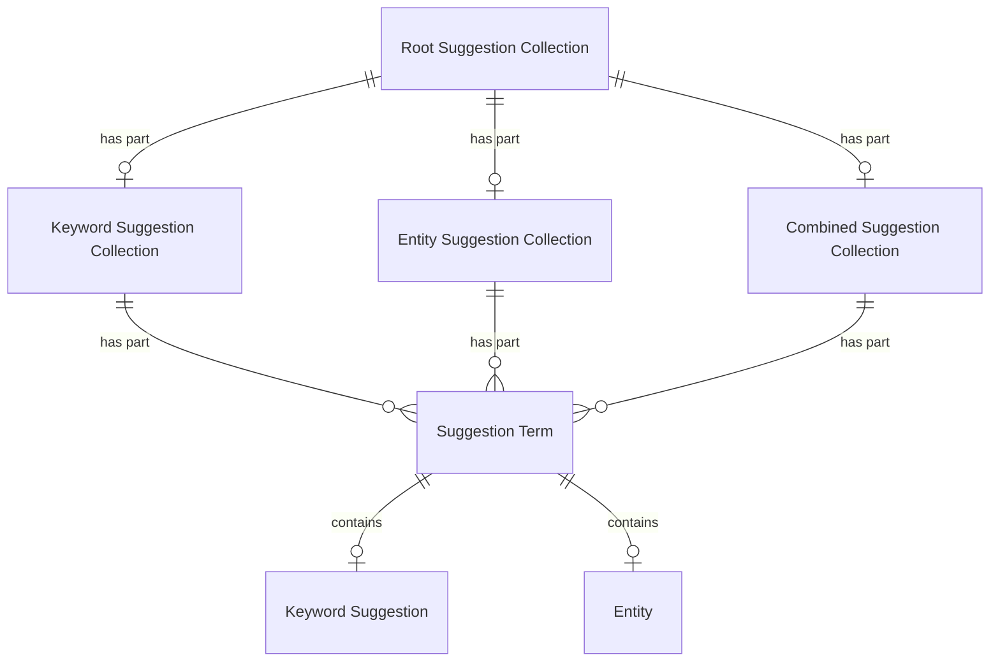

# Suggestions

## Introduction

A suggestion is a keyword or name displayed as a user types. For example: if a user types 'rem', suggestions might be 'Rembrandt' or 'Rem Koolhaas'. Suggestions help users save time. A user can select one of the suggested keywords or names and find entities matching the suggestion. This functionality is also known as autocompletion or typeahead.

Suggestions are tied to a [heritage collection](heritage-collections.md), ensuring that results remain within the context of a specific collection.

Suggestions are an _OPTIONAL_ [extension](extensions.md). A data layer may choose whether or not to implement them.

## Data model

| Name                           | Description                                                                                                                                 |
| ------------------------------ | ------------------------------------------------------------------------------------------------------------------------------------------- |
| Root Suggestion Collection     | A collection of suggestion collections.                                                                                                     |
| Suggestion Collection          | A collection of suggestions.                                                                                                                |
| Keyword Suggestion Collection  | A collection of keyword suggestions. Specialization of Suggestion Collection.                                                               |
| Entity Suggestion Collection   | A collection of entity suggestions. Specialization of Suggestion Collection.                                                                |
| Combined Suggestion Collection | A collection of keyword and entity suggestions. Specialization of Suggestion Collection.                                                    |
| Suggestion Term                | A selectable option within a suggestion collection, e.g. a keyword or entity.                                                               |
| Keyword Suggestion             | A keyword matching a suggestion query, e.g. 'windmill'. The keyword can be used as input to search for entities and find all that match it. |
| Entity                         | An [entity](entities.md) matching a suggestion query, e.g. a heritage object named 'A Watermill'.                                           |

The following entity-relationship diagram visualizes the data model:



> [!NOTE]
> **To be discussed**: replace the ER diagram with a class diagram to make the relationships clearer (e.g. inheritance).

## Search strategies

Suggestions can be found by using different search strategies. The data layer decides which strategy fits best. Common strategies include:

1. **Prefix search**. Prefix search restricts results to strings that start with the user's input. For example, the query `mil` will return `mill`, but not `windmill`. This strategy is optimized for speed and predictability; it is best suited for scenarios where users are searching for specific entities by their primary name or when the data layer wants to encourage an 'autocomplete-as-you-type' experience starting from the first letter.
1. **Infix search**. Infix search is a more flexible matching that looks for a query anywhere within a string. For example, the query `mil` will return `mill` and `windmill`. This is the recommended strategy when the data layer wants users to discover entities using parts of a name, even if they do not know exactly how the name begins. Be aware that infix search can be more computationally expensive than prefix search.

## Endpoint: Retrieve a root suggestion collection

The endpoint retrieves a root suggestion collection belonging to a heritage collection. The API _MUST_ implement this endpoint if it supports suggestions.

This is a discovery endpoint: it allows presentation layers to identify the suggestion collections and their endpoint URIs.

### HTTP request

`GET /{version}/{collections}(/{...collections})/{collection}/{extensions}/{suggestions}`

### Path parameters

| Name             | Data type | Cardinality | Description                                                                      |
| ---------------- | --------- | ----------- | -------------------------------------------------------------------------------- |
| `version`        | string    | 1           | The version of the API. Example: `v1`.                                           |
| `collections`    | string    | 1           | The path identifier of the top root heritage collection. Example: `collections`. |
| `...collections` | string    | 0 or more   | The path identifier(s) of further root heritage collections. Example: `objects`. |
| `collection`     | string    | 1           | The path identifier of the heritage collection. Example: `masterpieces`.         |
| `extensions`     | string    | 1           | The path identifier of the extension collection. Example: `extensions`.          |
| `suggestions`    | string    | 1           | The path identifier of the root suggestion collection. Example: `suggestions`.   |

### Query parameters

None.

### Request body

None.

### Response body

The response body _MUST_ contain at least the following fields:

| Name            | Data type            | Cardinality | Description                                                                                                                                                                                               |
| --------------- | -------------------- | ----------- | --------------------------------------------------------------------------------------------------------------------------------------------------------------------------------------------------------- |
| `id`            | string               | 1           | The identifier of the collection.                                                                                                                                                                         |
| `type`          | string               | 1           | The type of the collection. It _MUST_ be `RootSuggestionCollection`.                                                                                                                                      |
| `name`          | string               | 1           | A short, human-readable name of the collection.                                                                                                                                                           |
| `totalItems`    | number               | 1           | The total number of suggestion collections in the collection.                                                                                                                                             |
| `items`         | array                | 1           | A list of all suggestion collections. The API defines the order.                                                                                                                                          |
| `items[*]`      | SuggestionCollection | 1           | A suggestion collection.                                                                                                                                                                                  |
| `items[*].id`   | string               | 1           | The identifier of the suggestion collection.                                                                                                                                                              |
| `items[*].type` | string               | 1           | The type of the suggestion collection. It _MAY_ be one of `KeywordSuggestionCollection`, `EntitySuggestionCollection`, `CombinedSuggestionCollection` or a suggestion collection type defined by the API. |
| `items[*].name` | string               | 1           | A short, human-readable name of the suggestion collection.                                                                                                                                                |
| `partOf`        | ExtensionCollection  | 1           | The extension collection of which this extension is a part.                                                                                                                                               |
| `partOf.id`     | string               | 1           | The identifier of the extension collection.                                                                                                                                                               |
| `partOf.type`   | string               | 1           | The type of the extension collection. It _MUST_ be `ExtensionCollection`.                                                                                                                                 |

### Example

An example request from a presentation layer:

```http
GET /v1/collections/objects/extensions/suggestions HTTP/2
Host: example.org
```

The request indicates that the API should return the suggestion collection belonging to a heritage collection (`objects`).

An example of the response body of the API:

```json
{
  "id": "https://example.org/v1/collections/objects/extensions/suggestions",
  "type": "RootSuggestionCollection",
  "name": "Suggestions",
  "totalItems": 3,
  "items": [
    {
      "id": "https://example.org/v1/collections/objects/extensions/suggestions/keywords",
      "type": "KeywordSuggestionCollection",
      "name": "Keyword suggestions"
    },
    {
      "id": "https://example.org/v1/collections/objects/extensions/suggestions/entities",
      "type": "EntitySuggestionCollection",
      "name": "Entity suggestions"
    },
    {
      "id": "https://example.org/v1/collections/objects/extensions/suggestions/combinations",
      "type": "CombinedSuggestionCollection",
      "name": "Keyword and entity suggestions"
    }
  ],
  "partOf": {
    "id": "https://example.org/v1/collections/objects/extensions",
    "type": "ExtensionCollection"
  }
}
```

The response indicates that the API supports three suggestion collections for a heritage collection (`objects`): keyword suggestions, entity suggestions and combined suggestions.

## Endpoint: Suggest keywords

The endpoint retrieves a list of keywords matching a query. A presentation layer can use a keyword as input to [search for entities](heritage-collections.md#endpoint-retrieve-a-page-in-a-heritage-collection) and find all entities that match the keyword. The endpoint is _OPTIONAL_: it _MAY_ be implemented by the API.

### HTTP request

`GET /{version}/{collections}(/{...collections})/{collection}/{extensions}/{suggestions}/{suggestion}`

### Path parameters

| Name             | Data type | Cardinality | Description                                                                      |
| ---------------- | --------- | ----------- | -------------------------------------------------------------------------------- |
| `version`        | string    | 1           | The version of the API. Example: `v1`.                                           |
| `collections`    | string    | 1           | The path identifier of the top root heritage collection. Example: `collections`. |
| `...collections` | string    | 0 or more   | The path identifier(s) of further root heritage collections. Example: `objects`. |
| `collection`     | string    | 1           | The path identifier of the heritage collection. Example: `masterpieces`.         |
| `extensions`     | string    | 1           | The path identifier of the extension collection. Example: `extensions`.          |
| `suggestions`    | string    | 1           | The path identifier of the root suggestion collection. Example: `suggestions`.   |
| `suggestion`     | string    | 1           | The path identifier of the keyword suggestion collection. Example: `keywords`.   |

### Query parameters

| Name      | Data type | Cardinality | Description                                                                                                                                                                                                                                                 |
| --------- | --------- | ----------- | ----------------------------------------------------------------------------------------------------------------------------------------------------------------------------------------------------------------------------------------------------------- |
| `q`       | string    | 1           | A keyword query for filtering the suggestion terms. Minimum length: defined by the data layer (e.g. 3 characters). Maximum length: defined by the API (e.g. 25 characters). The API defines how the query is matched, e.g. by using prefix or infix search. |
| `size`    | number    | 0 or 1      | The maximum number of suggestion terms to retrieve. Minimum: 1. Default: 10. Maximum: defined by the API (e.g. 25).                                                                                                                                         |
| `orderBy` | string    | 0 or 1      | The sorting order of the suggestion terms. It _MUST_ be one of `relevance`, `value`. Default: `relevance:desc` (most relevant suggestion first). The API defines which value is used to sort by `value` (e.g. the `name` of a keyword).                     |

### Request body

None.

### Response body

The response body _MUST_ contain at least the following fields:

| Name                  | Data type                | Cardinality | Description                                                                                                            |
| --------------------- | ------------------------ | ----------- | ---------------------------------------------------------------------------------------------------------------------- |
| `id`                  | string                   | 1           | The identifier of the collection.                                                                                      |
| `type`                | string                   | 1           | The type of the collection. It _MUST_ be `KeywordSuggestionCollection`.                                                |
| `name`                | string                   | 1           | A short, human-readable name of the collection.                                                                        |
| `totalItems`          | number                   | 1           | The total number of suggestion terms in the collection.                                                                |
| `items`               | array                    | 1           | A list of suggestion terms. Empty if no suggestions matched the query.                                                 |
| `items[*]`            | SuggestionTerm           | 1           | A suggestion term.                                                                                                     |
| `items[*].type`       | string                   | 1           | The type of the suggestion term. It _MUST_ be `SuggestionTerm`.                                                        |
| `items[*].relevance`  | number                   | 1           | The relevance of the suggestion to the query. It _MUST_ be a whole number between 0 (not relevant) and 100 (relevant). |
| `items[*].value`      | KeywordSuggestion        | 1           | The suggested keyword.                                                                                                 |
| `items[*].value.type` | string                   | 1           | The type of the keyword. It _MUST_ be `KeywordSuggestion`.                                                             |
| `items[*].value.name` | string                   | 1           | The name of the keyword.                                                                                               |
| `partOf`              | RootSuggestionCollection | 1           | The root suggestion collection of which this suggestion collection is a part.                                          |
| `partOf.id`           | string                   | 1           | The identifier of the root suggestion collection.                                                                      |
| `partOf.type`         | string                   | 1           | The type of the root suggestion collection. It _MUST_ be `RootSuggestionCollection`.                                   |

### Example

An example request from a presentation layer:

```http
GET /v1/collections/objects/extensions/suggestions/keywords?q=mil HTTP/2
Host: example.org
```

The request indicates that the API should return keyword suggestions from a heritage collection (`objects`) matching a specific query (`mil`).

An example of the response body of the API:

```json
{
  "id": "https://example.org/v1/collections/objects/extensions/suggestions/keywords?q=mil",
  "type": "KeywordSuggestionCollection",
  "name": "Keyword suggestions",
  "totalItems": 2,
  "items": [
    {
      "type": "SuggestionTerm",
      "relevance": 98,
      "value": {
        "type": "KeywordSuggestion",
        "name": "mill"
      }
    },
    {
      "type": "SuggestionTerm",
      "relevance": 92,
      "value": {
        "type": "KeywordSuggestion",
        "name": "windmill"
      }
    }
  ],
  "partOf": {
    "id": "https://example.org/v1/collections/objects/extensions/suggestions",
    "type": "RootSuggestionCollection"
  }
}
```

## Endpoint: Suggest entities

The endpoint retrieves a list of entities matching a query. An entity in the list can then be [directly retrieved](entities.md#endpoint-retrieve-an-entity). The endpoint is _OPTIONAL_: it _MAY_ be implemented by the API.

### HTTP request

`GET /{version}/{collections}(/{...collections})/{collection}/{extensions}/{suggestions}/{suggestion}`

### Path parameters

| Name             | Data type | Cardinality | Description                                                                      |
| ---------------- | --------- | ----------- | -------------------------------------------------------------------------------- |
| `version`        | string    | 1           | The version of the API. Example: `v1`.                                           |
| `collections`    | string    | 1           | The path identifier of the top root heritage collection. Example: `collections`. |
| `...collections` | string    | 0 or more   | The path identifier(s) of further root heritage collections. Example: `objects`. |
| `collection`     | string    | 1           | The path identifier of the heritage collection. Example: `masterpieces`.         |
| `extensions`     | string    | 1           | The path identifier of the extension collection. Example: `extensions`.          |
| `suggestions`    | string    | 1           | The path identifier of the root suggestion collection. Example: `suggestions`.   |
| `suggestion`     | string    | 1           | The path identifier of the entity suggestion collection. Example: `entities`.    |

### Query parameters

| Name      | Data type | Cardinality | Description                                                                                                                                                                                                                                                 |
| --------- | --------- | ----------- | ----------------------------------------------------------------------------------------------------------------------------------------------------------------------------------------------------------------------------------------------------------- |
| `q`       | string    | 1           | A keyword query for filtering the suggestion terms. Minimum length: defined by the data layer (e.g. 3 characters). Maximum length: defined by the API (e.g. 25 characters). The API defines how the query is matched, e.g. by using prefix or infix search. |
| `size`    | number    | 0 or 1      | The maximum number of suggestion terms to retrieve. Minimum: 1. Default: 10. Maximum: defined by the API (e.g. 25).                                                                                                                                         |
| `orderBy` | string    | 0 or 1      | The sorting order of the suggestion terms. One of `relevance`, `value`. Default: `relevance:desc` (most relevant suggestion first). The API defines which value is used to sort by `value` (e.g. the `name` of an entity).                                  |

### Request body

None.

### Response body

The response body _MUST_ contain at least the following fields:

| Name                  | Data type                | Cardinality | Description                                                                                                            |
| --------------------- | ------------------------ | ----------- | ---------------------------------------------------------------------------------------------------------------------- |
| `id`                  | string                   | 1           | The identifier of the collection.                                                                                      |
| `type`                | string                   | 1           | The type of the collection. It _MUST_ be `EntitySuggestionCollection`.                                                 |
| `name`                | string                   | 1           | A short, human-readable name of the collection.                                                                        |
| `totalItems`          | number                   | 1           | The total number of suggestion terms in the collection.                                                                |
| `items`               | array                    | 1           | A list of suggestions terms. Empty if no suggestions matched the query.                                                |
| `items[*]`            | SuggestionTerm           | 1           | A suggestion term.                                                                                                     |
| `items[*].type`       | string                   | 1           | The type of the suggestion term. It _MUST_ be `SuggestionTerm`.                                                        |
| `items[*].relevance`  | number                   | 1           | The relevance of the suggestion to the query. It _MUST_ be a whole number between 0 (not relevant) and 100 (relevant). |
| `items[*].value`      | Entity                   | 1           | The suggested entity.                                                                                                  |
| `items[*].value.id`   | string                   | 1           | The identifier of the entity.                                                                                          |
| `items[*].value.type` | string                   | 1           | The [type](entities.md#entity-types) of the entity.                                                                    |
| `items[*].value.name` | string                   | 1           | The name of the entity.                                                                                                |
| `partOf`              | RootSuggestionCollection | 1           | The root suggestion collection of which this suggestion collection is a part.                                          |
| `partOf.id`           | string                   | 1           | The identifier of the root suggestion collection.                                                                      |
| `partOf.type`         | string                   | 1           | The type of the root suggestion collection. It _MUST_ be `RootSuggestionCollection`.                                   |

The API may expose additional fields about a suggested entity.

### Example

An example request from a presentation layer:

```http
GET /v1/collections/objects/extensions/suggestions/entities?q=mil HTTP/2
Host: example.org
```

The request indicates that the API should return entity suggestions from a heritage collection (`objects`) matching a specific query (`mil`).

An example of the response body of the API:

```json
{
  "id": "https://example.org/v1/collections/objects/extensions/suggestions/entities?q=mil",
  "type": "EntitySuggestionCollection",
  "name": "Entity suggestions",
  "totalItems": 2,
  "items": [
    {
      "type": "SuggestionTerm",
      "relevance": 98,
      "value": {
        "id": "https://example.org/v1/entities/objects/1234",
        "type": "HeritageObject",
        "name": "A Watermill"
        // Optionally: other fields
      }
    },
    {
      "type": "SuggestionTerm",
      "relevance": 92,
      "value": {
        "id": "https://example.org/v1/entities/objects/5678",
        "type": "HeritageObject",
        "name": "Windmill at Wijk bij Duurstede"
        // Optionally: other fields
      }
    }
  ],
  "partOf": {
    "id": "https://example.org/v1/collections/objects/extensions/suggestions",
    "type": "RootSuggestionCollection"
  }
}
```

## Endpoint: Suggest keywords and entities, combined

The endpoint retrieves a list of both keywords and entities matching a query. The API determines the distribution between keywords and entities returned (e.g. proportional or based on relevance). The endpoint is _OPTIONAL_: it _MAY_ be implemented by the API.

> [!NOTE]
> **To be discussed**: is this endpoint useful or do the separate endpoints - one for keywords, one for entities - suffice?

### HTTP request

`GET /{version}/{collections}(/{...collections})/{collection}/{extensions}/{suggestions}/{suggestion}`

### Path parameters

| Name             | Data type | Cardinality | Description                                                                                   |
| ---------------- | --------- | ----------- | --------------------------------------------------------------------------------------------- |
| `version`        | string    | 1           | The version of the API. Example: `v1`.                                                        |
| `collections`    | string    | 1           | The path identifier of the top root heritage collection. Example: `collections`.              |
| `...collections` | string    | 0 or more   | The path identifier(s) of further root heritage collections. Example: `objects`.              |
| `collection`     | string    | 1           | The path identifier of the heritage collection. Example: `masterpieces`.                      |
| `extensions`     | string    | 1           | The path identifier of the extension collection. Example: `extensions`.                       |
| `suggestions`    | string    | 1           | The path identifier of the root suggestion collection. Example: `suggestions`.                |
| `suggestion`     | string    | 1           | The path identifier of the keyword and entity suggestion collection. Example: `combinations`. |

### Query parameters

| Name      | Data type | Cardinality | Description                                                                                                                                                                                                                                                        |
| --------- | --------- | ----------- | ------------------------------------------------------------------------------------------------------------------------------------------------------------------------------------------------------------------------------------------------------------------ |
| `q`       | string    | 1           | A keyword query for filtering the suggestion terms. Minimum length: defined by the data layer (e.g. 3 characters). Maximum length: defined by the data layer (e.g. 25 characters). The API defines how the query is matched, e.g. by using prefix or infix search. |
| `size`    | number    | 0 or 1      | The maximum number of suggestion terms to retrieve. Default: 10. Maximum: 25.                                                                                                                                                                                      |
| `orderBy` | string    | 0 or 1      | The sorting order of the suggestion terms. One of `relevance`, `value`. Default: `relevance:desc` (most relevant suggestion first). The API defines which value is used to sort by `value` (e.g. the `name` of a keyword or the `name` of an entity).              |

### Request body

None.

### Response body

The response body _MUST_ contain at least the following fields:

| Name                  | Data type                 | Cardinality | Description                                                                                                            |
| --------------------- | ------------------------- | ----------- | ---------------------------------------------------------------------------------------------------------------------- |
| `id`                  | string                    | 1           | The identifier of the collection.                                                                                      |
| `type`                | string                    | 1           | The type of the collection. It _MUST_ be `CombinedSuggestionCollection`.                                               |
| `name`                | string                    | 1           | A short, human-readable name of the collection.                                                                        |
| `totalItems`          | number                    | 1           | The total number of suggestion terms in the collection.                                                                |
| `items`               | array                     | 1           | A list of suggestions terms. Empty if no suggestions matched the query.                                                |
| `items[*]`            | SuggestionTerm            | 1           | A suggestion term.                                                                                                     |
| `items[*].type`       | string                    | 1           | The type of the suggestion term. It _MUST_ be `SuggestionTerm`.                                                        |
| `items[*].relevance`  | number                    | 1           | The relevance of the suggestion to the query. It _MUST_ be a whole number between 0 (not relevant) and 100 (relevant). |
| `items[*].value`      | KeywordSuggestion, Entity | 1           | The suggested keyword or entity.                                                                                       |
| `items[*].value.id`   | string                    | 0 or 1      | The identifier of the entity. Not set if the `type` is `KeywordSuggestion`; a keyword has no identity.                 |
| `items[*].value.type` | string                    | 1           | The type of the keyword (it _MUST_ be `KeywordSuggestion`) or the [type](entities.md#entity-types) of the entity.      |
| `items[*].value.name` | string                    | 1           | The name of the keyword or entity.                                                                                     |
| `partOf`              | RootSuggestionCollection  | 1           | The root suggestion collection of which this suggestion collection is a part.                                          |
| `partOf.id`           | string                    | 1           | The identifier of the root suggestion collection.                                                                      |
| `partOf.type`         | string                    | 1           | The type of the root suggestion collection. It _MUST_ be `RootSuggestionCollection`.                                   |

The API may expose additional fields about a suggested entity.

### Example

An example request from a presentation layer:

```http
GET /v1/collections/objects/extensions/suggestions/combinations?q=mil HTTP/2
Host: example.org
```

The request indicates that the API should return keyword and entity suggestions from a heritage collection (`objects`) matching a specific query (`mil`).

An example of the response body of the API:

```json
{
  "id": "https://example.org/v1/collections/objects/extensions/suggestions/combinations?q=mil",
  "type": "CombinedSuggestionCollection",
  "name": "Keyword and entity suggestions",
  "totalItems": 2,
  "items": [
    {
      "type": "SuggestionTerm",
      "relevance": 98,
      "value": {
        "type": "KeywordSuggestion",
        "name": "windmill"
      }
    },
    {
      "type": "SuggestionTerm",
      "relevance": 95,
      "value": {
        "id": "https://example.org/v1/entities/objects/1234",
        "type": "HeritageObject",
        "name": "A Watermill"
        // Optionally: other fields
      }
    }
  ],
  "partOf": {
    "id": "https://example.org/v1/collections/objects/extensions/suggestions",
    "type": "RootSuggestionCollection"
  }
}
```
